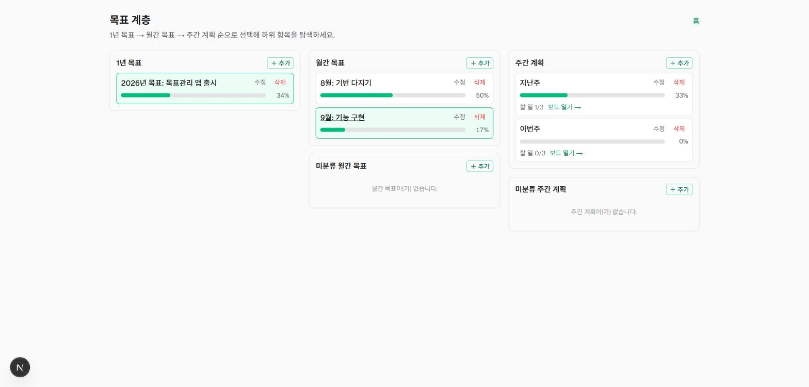
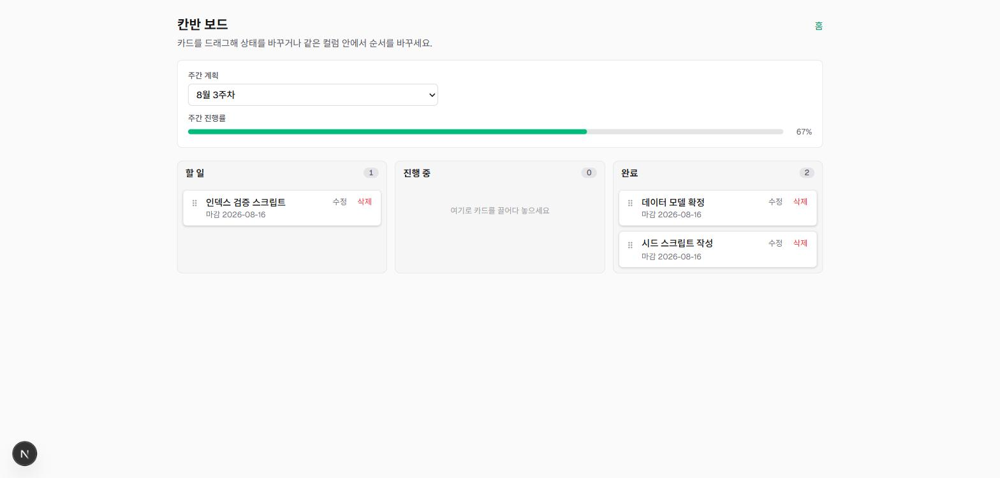
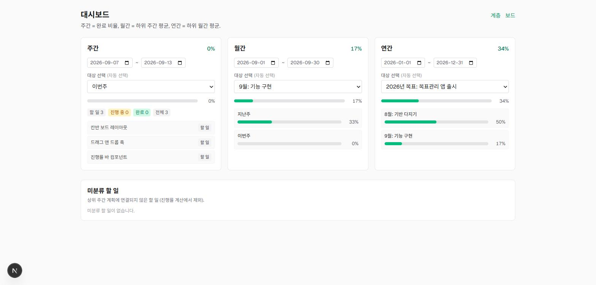

# 할 일 관리 앱 (4계층 목표관리)

일일 할 일 → 주간 계획 → 월간 목표 → 1년 목표를 부모-자식으로 연결하고,
하위 할 일의 상태 변경이 상위 진행률에 **동기적으로** 자동 반영되는 목표 관리 웹앱.

- 4계층 엔티티(DailyTask / WeeklyPlan / MonthlyGoal / YearlyGoal) CRUD
- 칸반 보드에서 Todo / Doing / Done 드래그 앤 드롭
- 상태 변경 즉시 주간 → 월간 → 연간 진행률 재계산 (denormalized, 서비스 계층 캐스케이드)
- 주간 / 월간 / 연간 대시보드
- 모든 화면 우측 상단에서 **할 일 추가** + **라이트/다크 테마 전환**

기획·설계 문서: [`docs/PRD.md`](docs/PRD.md), [`docs/PLAN.md`](docs/PLAN.md), 아키텍처: [`docs/CLAUDE.md`](docs/CLAUDE.md)

## 화면

| 목표 계층 (`/hierarchy`) | 칸반 보드 (`/board`) | 대시보드 (`/dashboard`) |
|---|---|---|
|  |  |  |
| 연간→월간→주간을 한 화면에서 탐색, 각 행에 진행률 바 | Todo/Doing/Done 드래그, 상단 주간 진행률이 즉시 갱신 | 주/월/년 진행률 + 하위 항목 분해 |

## 라이브 데모 (약 1분)

MongoDB 연결 문자열만 있으면 바로 실행됩니다. Atlas 무료 티어(M0)를 새로 만드는 방법은
[아래](#2-환경-변수) 참고.

```bash
git clone https://github.com/Latto-JD/Todo.git
cd Todo
npm install

# .env.local 생성 — 본인의 MongoDB URI로 교체
echo 'MONGODB_URI=mongodb+srv://<user>:<pass>@<cluster>.mongodb.net/todoapp' > .env.local

npm run seed     # 오늘 날짜 기준 샘플 트리 삽입 (진행률까지 계산됨)
npm run dev      # http://localhost:3000
```

`npm run seed`가 넣는 데이터는 **실행한 날짜를 기준**으로 이번 주/이번 달/올해에 걸치도록
생성되므로, `/dashboard`를 열면 "현재 기간" 기본 선택으로 바로 데이터가 보입니다.
위 스크린샷이 그 상태입니다.

DB 없이 코드만 검증하려면:

```bash
npm test          # 91개 — 실제 DB 미접촉 (in-memory MongoDB replica set)
npm run build     # 프로덕션 빌드
```

## 기술 스택

| 영역 | 선택 |
|---|---|
| 프레임워크 | Next.js 16 (App Router), React 19, TypeScript |
| DB | MongoDB (Mongoose 9) — Atlas M0 또는 로컬 replica set |
| API | Next.js Route Handlers (`app/api/**`), 서버 로직은 `lib/services` |
| 검증 | zod 4 (`lib/validation`) — 요청 검증 + 도메인 타입 원천 |
| 드래그 앤 드롭 | @dnd-kit/core + @dnd-kit/sortable |
| 서버 상태 | TanStack Query v5 (낙관적 업데이트 + 무효화) |
| 스타일 | Tailwind CSS v4 |
| 테스트 | Vitest + next-test-api-route-handler + mongodb-memory-server(replica set) + Playwright |

## 시작하기

### 1. 의존성 설치

```bash
npm install
```

### 2. 환경 변수

`.env.local` 파일을 만들고 MongoDB 연결 문자열을 넣습니다 (`.env.local.example` 참고):

```
MONGODB_URI=mongodb+srv://<user>:<pass>@<cluster>.mongodb.net/todoapp
```

> 진행률 재계산은 MongoDB 트랜잭션을 사용합니다. 트랜잭션은 **replica set**(Atlas는 기본 제공,
> 로컬은 `mongod --replSet rs0` + `rs.initiate()`)에서 동작하며, 미지원 환경에서는 순차 쓰기로
> 자동 폴백합니다.

### 3. 샘플 데이터 시드 (선택)

```bash
npm run seed
```

1 YearlyGoal → 2 MonthlyGoal → 4 WeeklyPlan → 12 DailyTask를 삽입하고, 각 주간 계획에
진행률 캐스케이드를 한 번 돌려 트리를 정합한 상태로 만듭니다. 날짜는 실행 시점 기준
상대값(지난달 2주 + 지난주 + 이번주)이라 대시보드의 현재 기간 선택에 바로 잡힙니다.

### 4. 개발 서버

```bash
npm run dev
```

- http://localhost:3000 — 홈
- `/hierarchy` — 연간→월간→주간 트리 탐색 + CRUD
- `/board` — 칸반 보드 (주간 계획 선택 후 드래그)
- `/dashboard` — 주간/월간/연간 진행률
- `/api/health` — `{ ok: true, db: "connected" }`

### 할 일 등록

할 일(DailyTask)은 세 군데에서 추가할 수 있습니다.

| 위치 | 동작 |
|---|---|
| 모든 화면 우측 상단 **할 일 추가** | 상위 주간 계획을 폼에서 선택 (미선택 시 "미분류") |
| `/board` 각 컬럼의 **＋ 추가** | 보고 있는 주간 계획 + 그 컬럼의 상태로 바로 생성 |
| `/hierarchy` 주간 계획 행의 **＋ 추가** | 해당 주간 계획 하위로 생성 |

기간(시작일·종료일)은 오늘 날짜로 미리 채워지고, 상위 3계층(1년·월간·주간)은
`/hierarchy`의 각 칼럼 **＋ 추가** 버튼으로 만듭니다.

### 테마

우측 상단 아이콘으로 라이트/다크를 전환합니다. 선택은 `localStorage`에 저장되고,
저장된 값이 없으면 OS 설정(`prefers-color-scheme`)을 따릅니다. 첫 페인트 전에
적용되므로 새로고침 시 흰 화면이 번쩍이지 않습니다.

## npm 스크립트

| 스크립트 | 설명 |
|---|---|
| `npm run dev` | 개발 서버 (`.env.local` 자동 로드) |
| `npm run build` | 프로덕션 빌드 |
| `npm run start` | 프로덕션 서버 |
| `npm run lint` | ESLint |
| `npm test` | Vitest — 서비스/진행률/route 통합 테스트 (in-memory MongoDB replica set, 실제 DB 미접촉) |
| `npm run test:watch` | Vitest watch 모드 |
| `npm run test:e2e` | Playwright e2e (`npm run dev`를 띄우므로 `.env.local`의 실제 DB 사용, 스펙이 자체 픽스처 생성·정리) |
| `npm run seed` | 샘플 데이터 삽입 (`.env.local`의 실제 DB) |

## 프로젝트 구조

```
app/
  page.tsx                     홈
  hierarchy/                   연간→월간→주간 트리 + CRUD
  board/                       칸반 보드 + DnD
  dashboard/                   진행률 대시보드
  api/
    health/                    DB 연결 확인
    daily-tasks/  weekly-plans/  monthly-goals/  yearly-goals/
                                 GET(목록) POST / GET PATCH DELETE([id])
    daily-tasks/[id]/move/     PATCH — status + order 원자 갱신 + 진행률 재계산
    board/                     GET ?parent_id= → { todo, doing, done }
    dashboard/{weekly,monthly,yearly}/[id]/   계층별 진행률 요약
components/                     KanbanColumn, TaskCard, EntityForm, ConfirmDeleteModal, ProgressBar, Toast ...
lib/
  db.ts                        Mongoose 연결 (global 캐시)
  models/                      Mongoose 스키마 4개 + 공통 base
  validation/                  zod 스키마 (create/update/query) + 파생 타입
  services/                    비즈니스 로직 (엔티티별 + progressService 캐스케이드)
  api-error.ts                 중앙 에러 → JSON 매핑, handleRoute 래퍼
  api-client.ts                클라이언트 fetch 래퍼
  queries/                     TanStack Query 훅
scripts/seed.ts                샘플 데이터
tests/                         Vitest (services, progress matrix, api routes)
e2e/                           Playwright
```

## 배포

Next.js 네이티브인 [Vercel](https://vercel.com)에 추가 설정 없이 배포됩니다. 요약:

1. Atlas → Network Access에 `0.0.0.0/0` 허용 (Vercel 서버리스는 고정 IP 없음)
2. [vercel.com/new](https://vercel.com/new)에서 이 저장소 Import (Framework: Next.js 자동 감지)
3. 환경 변수 설정 후 Deploy — `MONGODB_URI`, 그리고 빌드 최적화용 `MONGOMS_DISABLE_POSTINSTALL=1`
4. `https://<프로젝트>.vercel.app/api/health` 가 `{ ok: true, db: "connected" }` 인지 확인

단계별 안내: [`docs/DEPLOY.md`](docs/DEPLOY.md)
